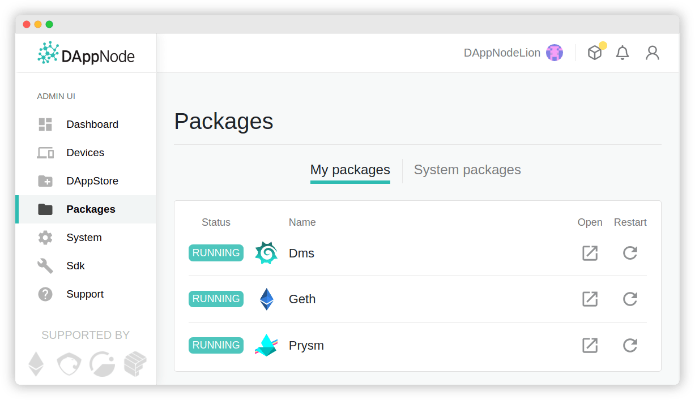
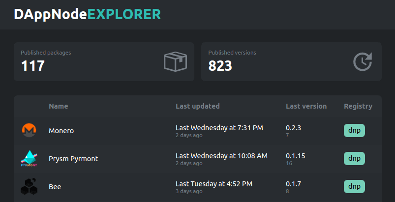

# DAppNode

 

  

 

  

 

### Infrastructure for the decentralized world

DAppNode is empowering people by creating a simple, transparent system for hosting P2P clients for DApps, Cryptocurrencies, VPNs, IPFS and more

- Read about our purpose and mission https://dappnode.io/
- Join our community https://discord.gg/c28an8dA5k
- Check out what we are delivering https://medium.com/dappnode
- Share your ideas and support from us https://discourse.dappnode.io/

# Discover DAppNode

DAppNode lowers the barrier of entry for non tech-savy participants. It allows you to deploy, update, and manage P2P clients and nodes without leaving your browser. No terminal or command line interface.

  

# Develop with DAppNode

DAppNode modular architecture allows any team to or project to publish a dockerized application to the DAppNode packages eco-system. Benefit from an enthusiatic crypto savy user based and offer a user interface-only experience to lower onboarding friction.

Check out the [DAppNodeSDK](https://github.com/dappnode/DAppNodeSDK) to learn how to get started.

_Note: packages are published to Ethereum mainnet and incur costs. Given the current high gas prices the DAppNode team is willing to subsidize gas costs for packages of great interest to users._

# Packages eco-system

The community and core team members have created many useful packages for users. Checkout the [**package explorer**](https://explorer.dappnode.io) to browse an up-to-date list of all packages and their versions.

  

## Champions

Champions are community members that are in charge of maintaining packages updated. All packages in this list without a champions are actively looking for a champion. Join our [DAppNode Discord **#champion-process**](https://discord.gg/MhSPBsHryu) to suggest a package to be championed and/or offer to be a champion for a project you care about!

| Package                                                                                  | Champion         |
| ---------------------------------------------------------------------------------------- | ---------------- |
| [Avalanche](https://github.com/Colm3na/DAppNodePackage-avalanche)                        | -                |
| [ARTIS-sigma1](https://github.com/lab10-coop/DAppNodePackage-ARTIS-sigma1)               | -                |
| [Bee](https://github.com/dappnode/DAppNodePackage-bee)                                   | @tropicar        |
| [Bitcoin](https://github.com/dappnode/DAppNodePackage-bitcoin)                           | @Pol-Lanski      |
| [Block-explorer](https://github.com/dappnode/DappnodePackage-block-explorer)             | -                |
| [Cosmos](https://github.com/Colm3na/DAppNodePackage-cosmos)                              | -                |
| [DMS](https://github.com/dappnode/DAppNodePackage-DMS)                                   | -                |
| [Eth2stats-client](https://github.com/dappnode/DAppNodePackage-eth2stats-client)         | -                |
| [Ethereum Classic](https://github.com/dappnode/DAppNodePackage-ethereum-classic)         | -                |
| [Ethereum Optimism](https://github.com/dappnode/DAppNodePackage-ethereum-optimism)       | -                |
| [Exporter](https://github.com/dappnode/DAppNodePackage-exporter)                         | -                |
| [Geth](https://github.com/dappnode/DAppNodePackage-geth)                                 | @pablomendezroyo |
| [Goerli Geth](https://github.com/dappnode/DAppNodePackage-goerli-geth)                   | @pablomendezroyo |
| [Grin](https://github.com/dappnode/DAppNodePackage-grin)                                 | -                |
| [HTTPs Portal](https://github.com/dappnode/DAppNodePackage-https-portal)                 | -                |
| [Ipfs Cluster](https://github.com/dappnode/DAppNodePackage-ipfs-cluster)                 | -                |
| [Ipfs Pinner](https://github.com/dappnode/DAppNodePackage-ipfs-pinner)                   | -                |
| [Kovan](https://github.com/dappnode/DAppNodePackage-kovan)                               | -                |
| [LightningNetwork](https://github.com/dappnode/DAppNodePackage-LightningNetwork)         | @pablomendezroyo |
| [Matrix](https://github.com/dappnode/DAppNodePackage-matrix)                             | -                |
| [Metrics Tools](https://github.com/dappnode/DAppNodePackage-metrics-tools)               | -                |
| [Monero](https://github.com/dappnode/DAppNodePackage-monero)                             | @pablomendezroyo |
| [Nethermind](https://github.com/dappnode/DAppNodePackage-nethermind)                     | -                |
| [Openethereum](https://github.com/dappnode/DAppNodePackage-openethereum)                 | -                |
| [Owncloud](https://github.com/dappnode/DAppNodePackage-owncloud)                         | -                |
| Polkadot Kusama                                                                          | @tropicar        |
| [Prysm](https://github.com/dappnode/DAppNodePackage-prysm)                               | @pablomendezroyo |
| [Prysm Pyrmont](https://github.com/dappnode/DAppNodePackage-prysm-pyrmont)               | @pablomendezroyo |
| [Raiden](https://github.com/dappnode/DAppNodePackage-raiden)                             | -                |
| [Raiden Testnet](https://github.com/dappnode/DAppnodePackage-raiden-testnet)             | -                |
| [Rinkeby](https://github.com/dappnode/DAppNodePackage-rinkeby)                           | @pablomendezroyo |
| [Ropsten](https://github.com/dappnode/DAppNodePackage-ropsten)                           | @pablomendezroyo |
| [Storj](https://github.com/dappnode/DAppNodePackage-storj)                               | @pablomendezroyo |
| [Tornado Cash Relayer](https://github.com/dappnode/DAppNodePackage-Tornado-Cash-Relayer) | -                |
| [Trustlines](https://github.com/dappnode/DAppNodePackage-trustlines)                     | -                |
| [Trustlines bridge](https://github.com/dappnode/DAppNodePackage-trustlines-bridge)       | -                |
| [Trustlines monitor](https://github.com/dappnode/DAppNodePackage-trustlines-monitor)     | -                |
| [Trustlines netstats](https://github.com/dappnode/DAppNodePackage-trustlines-netstats)   | -                |
| [Trustlines validator](https://github.com/dappnode/DAppNodePackage-trustlines-validator) | -                |
| [Turbo-geth](https://github.com/dappnode/DAppNodePackage-turbo-geth)                     | -                |
| [Vipnode](https://github.com/dappnode/DAppNodePackage-vipnode)                           | -                |
| [Wireguard](https://github.com/dappnode/DAppNodePackage-wireguard)                       | -                |
| [ZCash](https://github.com/dappnode/DAppNodePackage-zcash)                               | -                |

# Core packages

- [DNP_DAPPMANAGER](https://github.com/dappnode/DNP_DAPPMANAGER)
- [DNP_VPN](https://github.com/dappnode/DNP_VPN)
- [DNP_IPFS](https://github.com/dappnode/DNP_IPFS)
- [DNP_BIND](https://github.com/dappnode/DNP_BIND)

# Team members

Members of the [White Hat Group (WHG)](https://motherboard.vice.com/en_us/article/qvp5b3/how-ethereum-coders-hacked-back-to-rescue-dollar208-million-in-ethereum) have spent countless hours boostraping and developing DAppNode in 2017. Currently, the project is mantained by a growing multi-disciplary team:

- **Adviser & Instigator:** Jordi Baylina
- **Project Lead:** Eduadiez
- **Developer Lead:** dapplion
- **Ecosystem Development** Pol Lanski
- **Developer:** Pablo
- **Developer:** Carlos
- **Adviser:** Griff Green

## License

This project is licensed under the GNU General Public License v3.0 - see the [LICENSE](LICENSE) file for details
