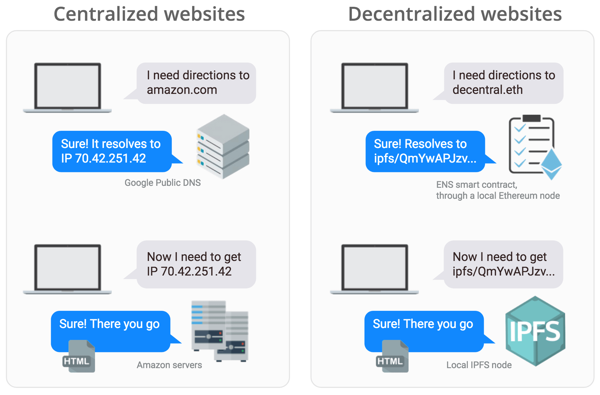

.. index:: ! examples

.. _dappnode-by-example:

###################
DAppNode by Example
###################

Examples to describe its functionality and purpose

********************************
Accessing decentralized websites
********************************

What is a decentralized website?
################################

A decentralized website is not controlled by a central entity, rather by its users. It is unstoppable and uncensorable, therefore it doesn't rely on any centralized service. 

To navigate to decentralized websites using human readable names (i.e. decentral.eth) you need:
- IPFS to store the website contents
- ENS (or similar) to point users to the hash of the website contents

=================  ===============================  ===================================
Step               Centralized                      Decentralized
=================  ===============================  ===================================
Resolve domain     Use a DNS (i.e. google's)        Use ENS, an ethereum smart contract
Get the website    GET request to the server's IP   Get the hash's content from IPFS    
=================  ===============================  ===================================

*****************************************
Using DApps without centralized providers
*****************************************