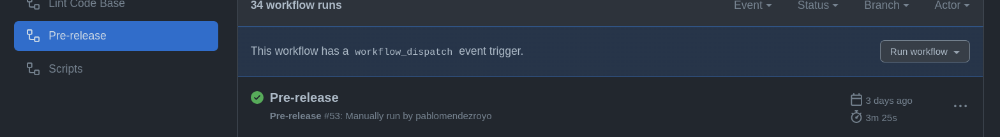
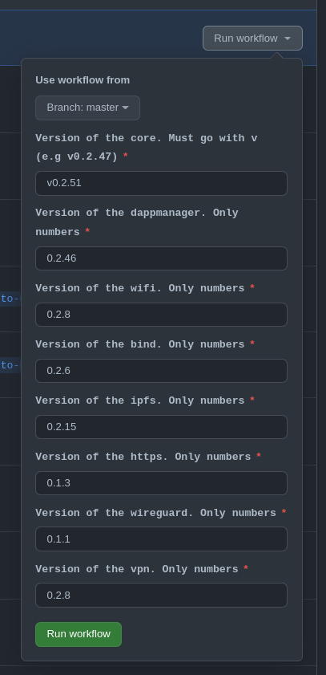

## Installer instructions

DAppNode releases are triggered through the [DNP_CORE](https://github.com/dappnode/DNP_CORE) package, when new core packages are released the DNP_CORE [dependencies](https://github.com/dappnode/DNP_CORE/blob/fc0891669870407f3673a8a6273df780efadd902/dappnode_package.json#L23) are updated with the new versions. Within core packages there are **mandatory** core packages and **non-mandatory** core packages. Both of them are part of the system packages category and perform critical action in DAppNode, such as connectivity methods, IPFS hash server for packages hashes, DNS resolver for dappnode domains and more.

- Mandatory: [BIND](https://github.com/dappnode/DNP_BIND), [DAPPMANAGER](https://github.com/dappnode/DNP_DAPPMANAGER), [IPFS](https://github.com/dappnode/DNP_IPFS) and [WIFI](https://github.com/dappnode/DNP_WIFI)
- Non-mandatory: [WIREGUARD](https://github.com/dappnode/DNP_WIREGUARD), [HTTPS](https://github.com/dappnode/DNP_HTTPS) and [VPN](https://github.com/dappnode/DNP_VPN)

The installer is the repository in charge of generating all the **installation assets** for a DAppNode core specific release.

### Release assets

DAppNode can be installed in several ways, check out the [docs]() for more information. The assets generated in each release are used to update all the installation methods used to install DAppNode.

i.e

```
 DAppNode-v0.2.51-debian-bullseye-amd64-unattended.iso  922 MB
 DAppNode-v0.2.51-debian-bullseye-amd64.iso  922 MB
 dappnode_access_credentials.sh   3.96 KB
 dappnode_install.sh   12.7 KB
 dappnode_install_pre.sh  8.74 KB
 dappnode_profile.sh   2.51 KB
 dappnode_uninstall.sh   2.2 KB
 Source code (zip)
 Source code (tar.gz)
```

### What is installed by default?

By default either script and ISO installs the following core packages (see [ref](https://github.com/dappnode/DAppNode/blob/bdf4bf52a8c18b864a91bec6d625f8de206a2074/iso/scripts/download_core.sh#L17)): DAPPMANAGER, HTTPS, WIFI, WIREGUARD, IPFS and BIND.

Deppending on a few requisites, such as HTTPS ports are in used or there is no Kernel driver for WIREGUARD, the HTTPS package may not be installed and the WIREGUARD package will be switch by the VPN package.

### How to generate a new DAppNode release?

There is a CI in the repository to generate a new DAppNode release. This CI requires manual input to be triggered and takes as inputs the versions of the core packages used to generate the release. It is mandatory that this core packages versions exists in their corresponding repositories in the releases section.

The release action will generate all the assets required as well as the release-changelog.md used to display all the information in a release, excluding the changelog that will be required to introduced manually by editing the release generated

1. Trigger release
   

2. Set inputs for the release
   
